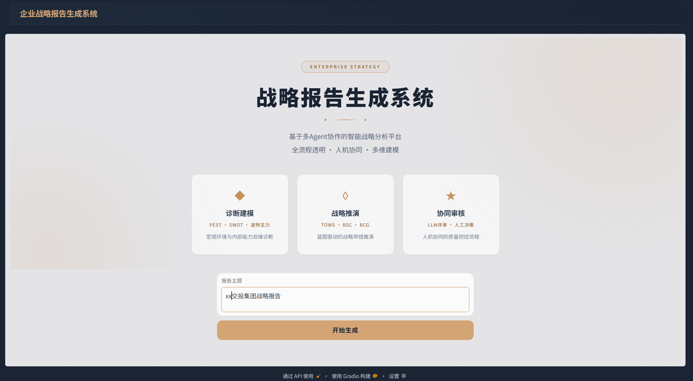
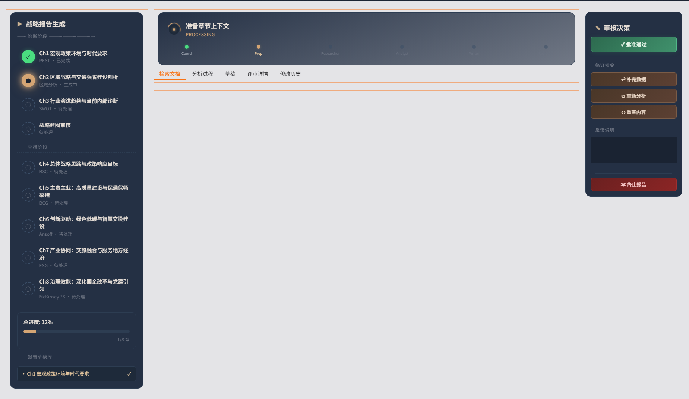
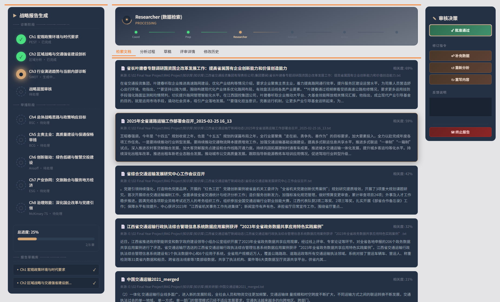
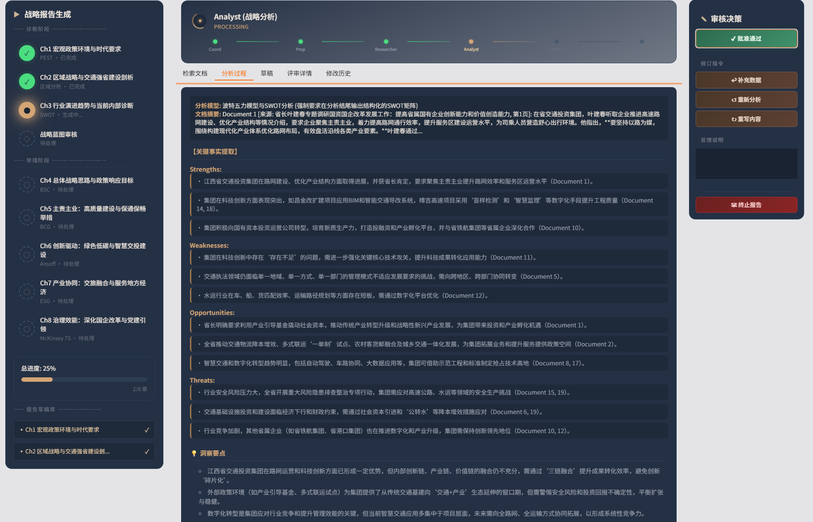
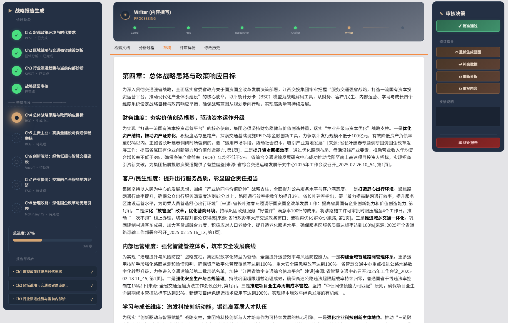
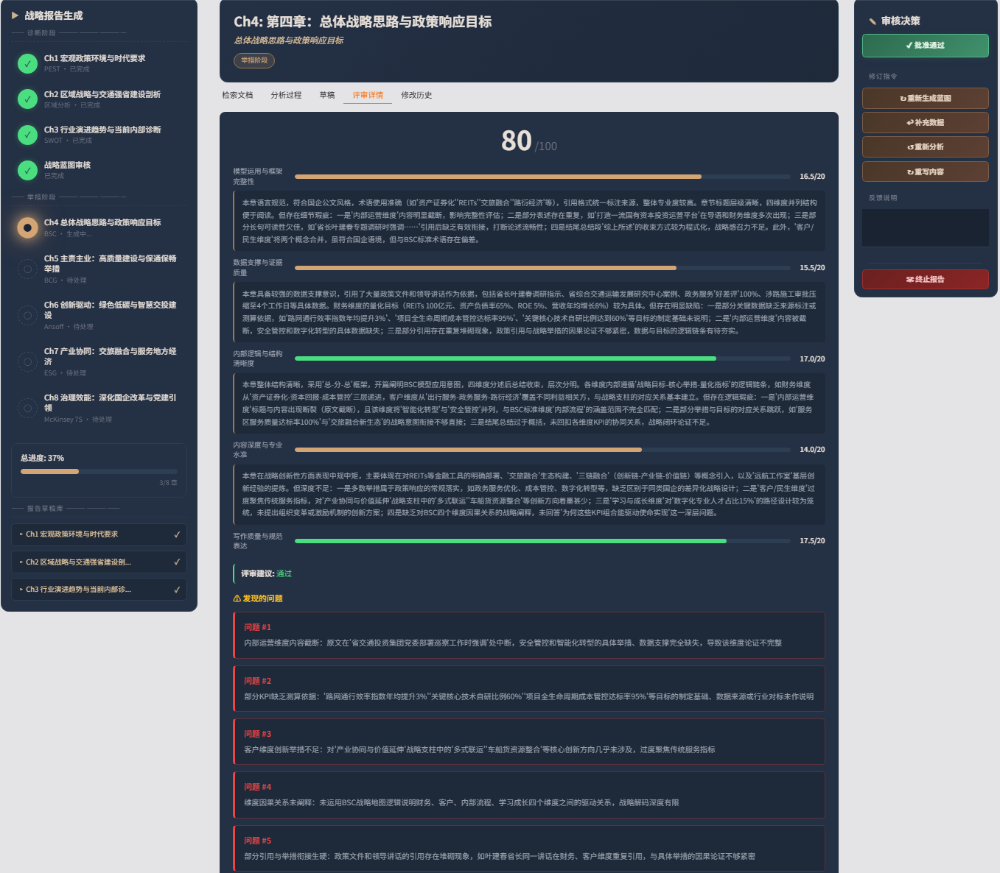
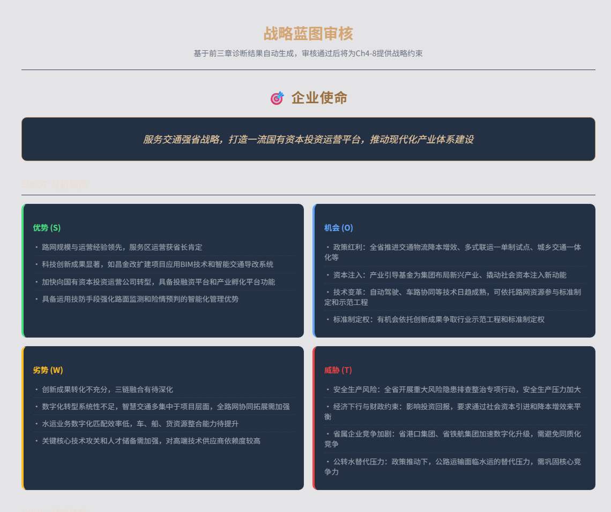
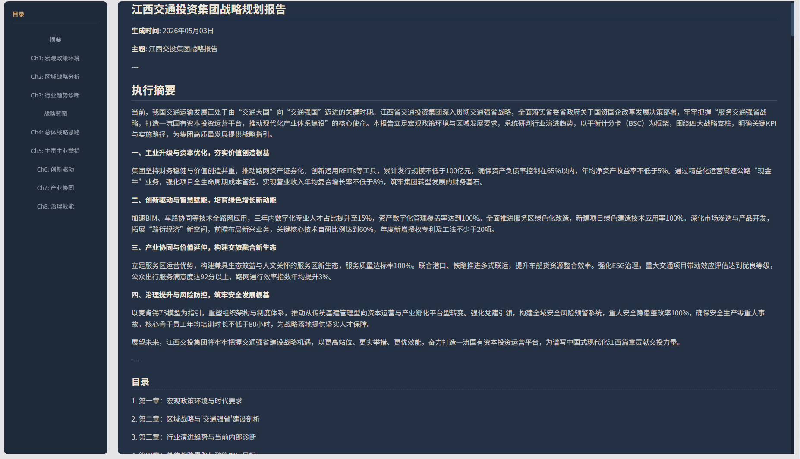

# RAG Project - 战略报告生成系统

基于检索增强生成(RAG)的多智能体战略报告生成系统，集成 LangGraph 工作流和 Gradio 前端。

## 项目简介

本项目是一个面向企业战略规划的全自动报告生成系统。系统采用"诊断-推演"两阶段架构，通过 LangGraph 编排多个专职 Agent（Coordinator、Researcher、Analyst、Writer、Strategist 等），结合 RAG 知识库检索与混合重排序，自动完成从大纲规划、信息检索、结构化分析到章节撰写的完整报告生成流程。

**核心特性：**
- **多智能体协同**：基于 LangGraph 的 8 节点工作流，每个 Agent 各司其职
- **混合检索策略**：稠密向量 (BGE-M3) + BM25 稀疏检索 + Reranker 重排序
- **两阶段推演**：先完成诊断分析（PEST/SWOT/波特五力），再推导战略蓝图，最后在蓝图约束下完成战略推演
- **LLM + 人工协同审核**：独立评审模型预审 + 人工最终决策，确保输出质量
- **三层记忆架构**：外部知识库 / 全局状态 / 章节工作区，有效管理长文档上下文

## 前端展示

### 报告生成主界面

**开始页 - 输入报告需求**



**准备阶段 - 章节状态初始化**



### 多智能体工作流程

**信息检索 - 多查询 RAG 检索**



**分析过程 - 战略模型驱动分析**



**内容撰写 - 章节正文生成**



**AI 评审详情 - 六维质量评估**



### 战略蓝图与最终报告

**战略蓝图 - SWOT/TOWS/KPI**



**报告整体 - 多章节完整输出**



---

## 知识库文档

将知识库文档放置在 `知识库/知识库/` 目录下：

```
知识库/
└── 知识库/
    ├── 政府文件/      # 按来源分类
    │   ├── 政策文件1.txt
    │   ├── 政策文件2.txt
    ├── XX集团有限责任公司/
    │   ├── 年报2024.txt
    │   ├── 战略规划.txt
    ├── 相关研报/
    │   ├── 行业分析报告.txt
    └── 相关论文/
        └── 学术研究.txt
```

**支持的文档格式：**
- `.txt` — 纯文本文件（主要格式，推荐）
- `.pdf` — PDF 文档（需先转换为 TXT）
- `.docx` — Word 文档（需先转换为 TXT）

**PDF 转换：**

```bash
# 批量转换 PDF 到 TXT
python scripts/pypdf_batch_converter.py --input "知识库/知识库/xxx.pdf"

# 清理转换后的文本
python scripts/clean_converted_pdf.py --input "知识库/知识库"
```

---

## 快速开始

### 1. 环境要求

- Python 3.10+
- Docker Desktop (用于 Milvus 向量数据库)
- NVIDIA GPU (推荐，用于本地嵌入模型加速)

**Docker Desktop 安装：**

- Windows/Mac: 下载 [Docker Desktop](https://www.docker.com/products/docker-desktop/) 并安装
- Linux: 参考 [Docker 官方文档](https://docs.docker.com/engine/install/)

安装后启动 Docker Desktop，确认运行正常：
```bash
docker --version
docker ps
```

### 2. 安装依赖

```bash
# 创建虚拟环境 (推荐)
python -m venv venv

# Windows 激活
venv\Scripts\activate

# Linux/macOS 激活
source venv/bin/activate

# 安装依赖
pip install -r requirements.txt
pip install -r requirements-agent.txt
```

### 3. 配置 API Key

复制环境变量模板并填入密钥：

```bash
cp .env.example .env
```

编辑 `.env` 文件，填入以下 API Key：

```
# 主 LLM (DeepSeek) - 必需
DEEPSEEK_API_KEY=sk-your-deepseek-api-key

# 评审 LLM (SiliconFlow) - 必需
SILICONFLOW_API_KEY=sk-your-siliconflow-api-key

# 可选：嵌入 API
OPENAI_API_KEY=sk-your-openai-api-key
GLM_API_KEY=your-glm-api-key
```

### 4. 启动 Milvus 向量数据库

```bash
# Windows
start_milvus.bat

# Linux/macOS
docker-compose up -d
```

等待约 30 秒，确认容器运行：

```bash
docker ps | grep milvus
```

### 5. 索引知识库文档

```bash
# 索引单个文件
python rag_project/main.py index "知识库/知识库/文档.txt"

# 索引整个目录
python rag_project/main.py index "知识库/知识库" --chunks-output data/chunks.json

# 使用混合检索索引 (推荐)
python scripts/rebuild_hybrid_index.py
```

---

## RAG 管线使用

### 文档索引

```bash
# 标准管线 (纯向量检索)
python rag_project/main.py index <文件或目录路径>

# 混合管线 (向量 + BM25，推荐)
python scripts/rebuild_hybrid_index.py
```

### 文档搜索

```bash
# 基础搜索
python rag_project/main.py search "交通投资政策" --top-k 10

# 按文档类型过滤
python rag_project/main.py search "高速公路建设规划" --doc-type pdf --doc-type txt
```

### 清空向量库

```bash
python scripts/rebuild_hybrid_index.py --clear
```

---

## Agent 前后端部署

### 启动 Gradio 前端 (推荐)

```bash
python scripts/run_frontend.py
```

访问 http://localhost:7860 进入 Web 界面。

**功能特性：**
- 交互式报告生成
- 实时进度显示
- 章节预览与编辑
- LLM 质量评审
- 人工审核与修订

### CLI 模式 (命令行)

```bash
# 交互模式 (推荐首次使用)
python scripts/run_agent_report.py "生成2026年江西交通投资集团战略规划报告"

# 自动模式 (无人工干预)
python scripts/run_agent_report.py "生成战略分析报告" --auto

# 指定输出路径
python scripts/run_agent_report.py "生成年度总结" --output reports/summary.md
```

### 启动嵌入服务 (可选)

如果需要本地 BGE-M3 嵌入服务：

```bash
# Windows
start_bge_server.bat

# 或直接运行
python bge_m3_server.py
```

服务地址：http://localhost:8080

---

## 配置说明

配置文件位于 `config/` 目录：

| 文件 | 说明 |
|------|------|
| `agent_config.yaml` | LLM 配置、Agent 参数、检索策略 |
| `milvus_config.yaml` | Milvus 连接、嵌入模型配置 |
| `chunking_config.yaml` | 文档分块策略 |
| `reranker_config.yaml` | 重排序模型配置 |

### 关键配置项

**LLM 配置** (`config/agent_config.yaml`)：

```yaml
llm:
  provider: "deepseek"
  model: "deepseek-chat"
  api_key_env: "DEEPSEEK_API_KEY"

reviewer:
  provider: "siliconflow"
  model: "Qwen/Qwen3.5-122B-A10B"
  api_key_env: "SILICONFLOW_API_KEY"
```

**检索策略** (`config/agent_config.yaml`)：

```yaml
retrieval:
  strategy: "hybrid"     # "dense" | "hybrid"
  hybrid_ranker: "rrf"   # "rrf" | "weighted"
```

**嵌入模型** (`config/milvus_config.yaml`)：

```yaml
embedding:
  mode: "api"            # "local" | "api"
  api_provider: "siliconflow"
  api_model: "BAAI/bge-m3"
```

---

## 项目结构

```
RAG Project/
├── config/                    # 配置文件
│   ├── agent_config.yaml      #   Agent 和 LLM 配置
│   ├── milvus_config.yaml     #   Milvus 和嵌入配置
│   ├── chunking_config.yaml   #   分块策略
│   └── reranker_config.yaml   #   重排序配置
│
├── rag_project/               # 核心代码
│   ├── main.py                #   RAG 管线入口
│   ├── pipeline.py            #   标准 RAG 管线
│   ├── pipeline_hybrid.py     #   混合检索管线
│   ├── data_loader/           #   文档加载与分块
│   ├── embeddings/            #   向量化嵌入
│   ├── storage/               #   Milvus 存储管理
│   ├── reranker/              #   重排序模块
│   ├── agent/                 #   Agent 模块
│   │   ├── graph.py           #     LangGraph 工作流
│   │   ├── state.py           #     状态定义
│   │   ├── cli.py             #     CLI 接口
│   │   ├── frontend/          #     Gradio 前端
│   │   └── nodes/             #     工作流节点
│   └── utils/                 #   工具模块
│
├── scripts/                   # 运行脚本
│   ├── run_frontend.py        #   启动前端
│   ├── run_agent_report.py    #   CLI 报告生成
│   ├── rebuild_hybrid_index.py#   重建混合索引
│   └── rebuild_dense_index.py #   重建稠密索引
│
├── rag_eval/                  # RAG 评估模块
├── ablation_experiment/       # 消融实验模块
├── tests/                     # 单元测试
│
├── 知识库/                    # 知识库文档
├── data/models/               # 本地模型缓存
├── volumes/                   # Milvus 数据卷
├── output/                    # 输出目录
│
├── docker-compose.yml         # Milvus Docker 配置
├── bge_m3_server.py           # BGE-M3 嵌入服务
├── start_milvus.bat           # 启动 Milvus
├── start_bge_server.bat       # 启动嵌入服务
├── requirements.txt           # RAG 依赖
└── requirements-agent.txt     # Agent 依赖
```

---

## 评估模块

### RAG 评估

```bash
cd rag_eval
python evaluate_unified.py
```

### 消融实验

```bash
cd ablation_experiment
python runner.py
```

---

## 常见问题

### Milvus 连接失败

```bash
# 检查容器状态
docker ps | grep milvus

# 查看日志
docker logs milvus-standalone

# 重启 Milvus
docker-compose down
docker-compose up -d
```

### 嵌入模型加载失败

确保 `config/milvus_config.yaml` 中配置正确：

```yaml
embedding:
  mode: "api"  # 使用 API 避免本地模型加载
  api_provider: "siliconflow"
```

### GPU 内存不足

```bash
# 设置环境变量使用 CPU
export CUDA_VISIBLE_DEVICES=""
```

---

## 停止服务

```bash
# 停止 Milvus
stop_milvus.bat
# 或
docker-compose down

# 停止嵌入服务
# Ctrl+C 终止 bge_m3_server.py
```

---

## 技术栈

| 组件 | 技术 |
|------|------|
| 工作流编排 | LangGraph |
| LLM | DeepSeek / Qwen (via OpenAI SDK) |
| 嵌入模型 | BAAI/bge-m3 |
| 向量数据库 | Milvus 2.6 |
| 前端 | Gradio |
| 文档解析 | PyMuPDF, pdfplumber, python-docx |
