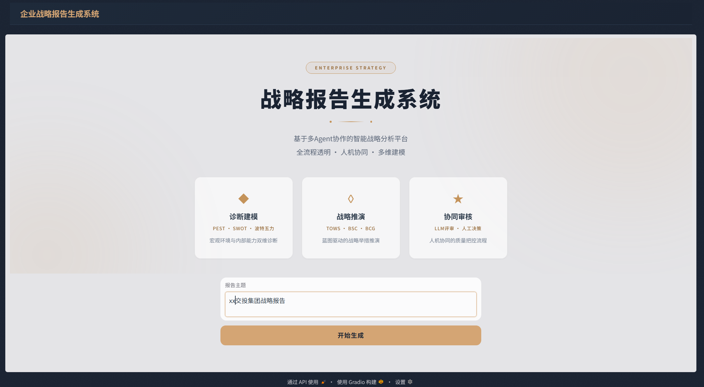
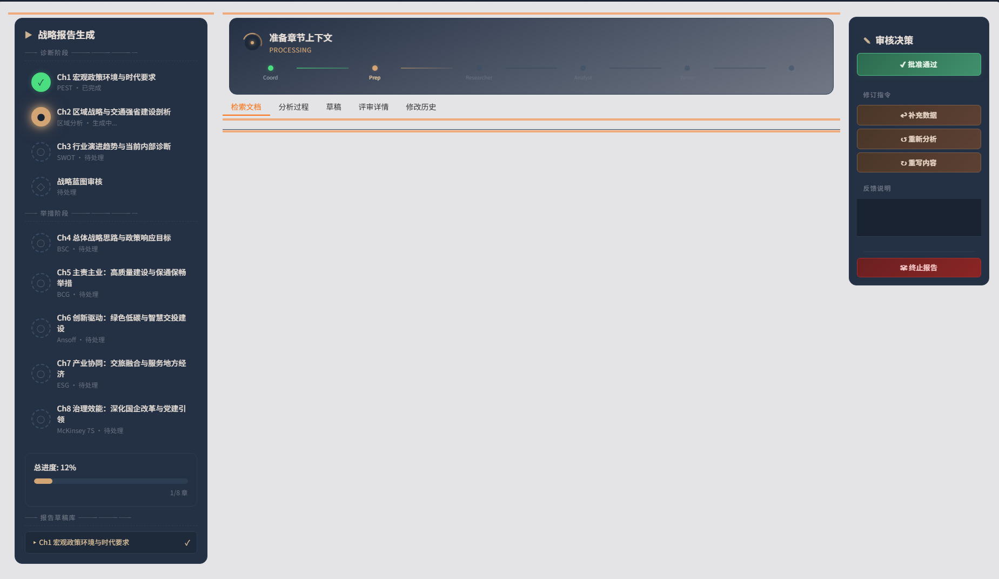
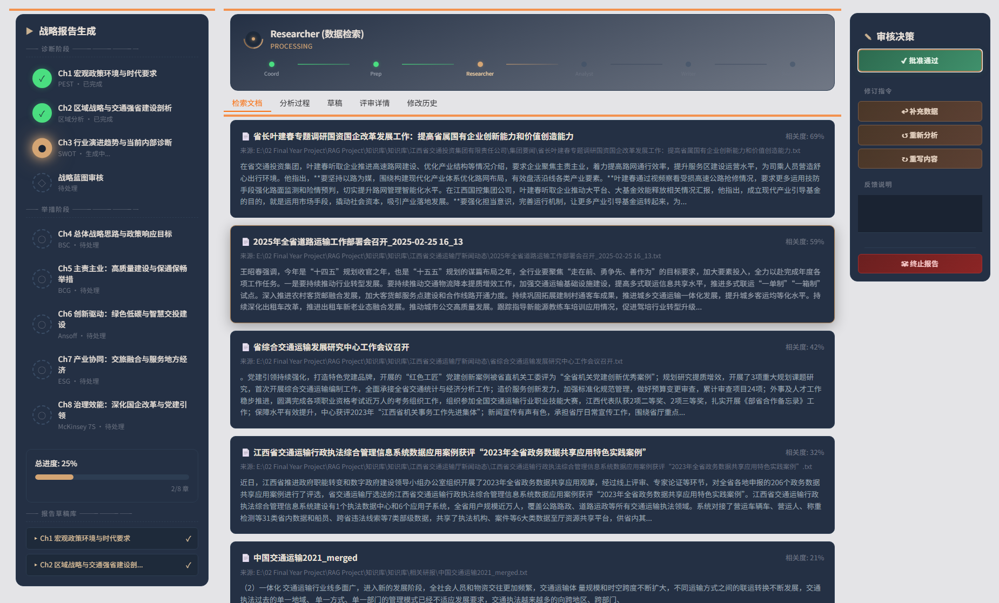
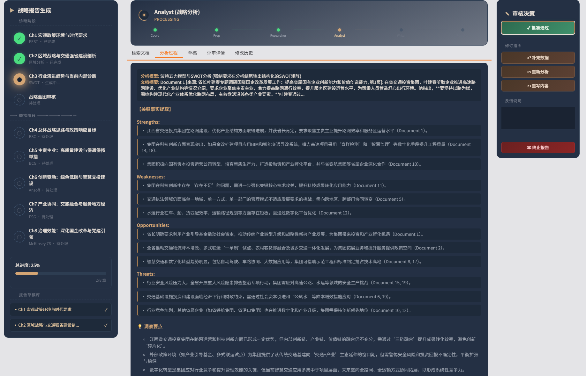
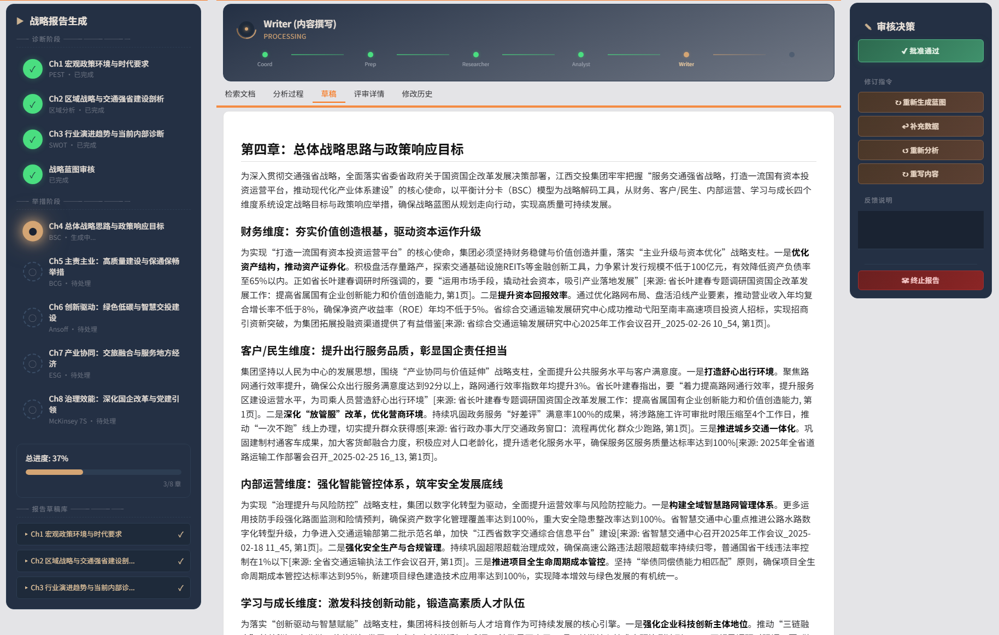
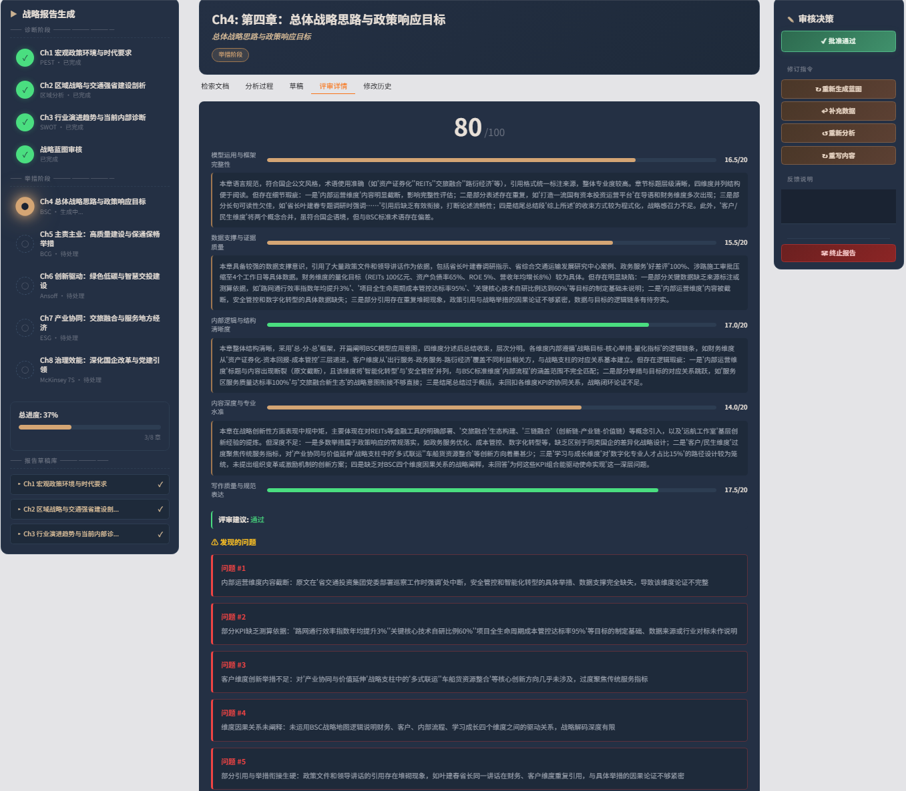
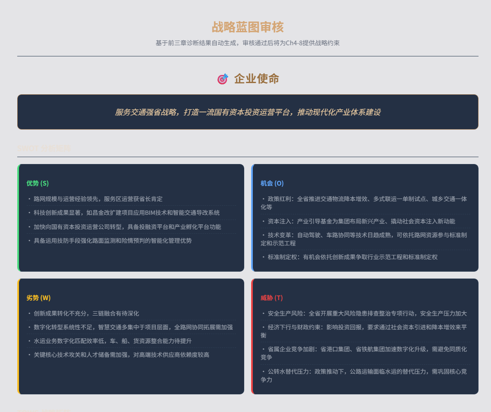
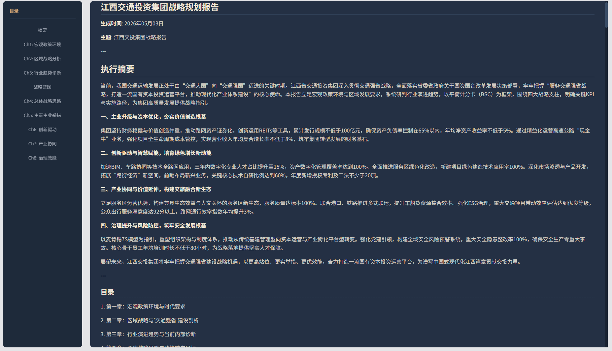

# RAG Project - Strategic Report Generation System

<p align="right">
  <a href="README.md">简体中文</a> | <strong>English</strong>
</p>

A multi-agent strategic report generation system powered by retrieval-augmented generation (RAG), with a LangGraph workflow and a Gradio frontend.

## Overview

This project is a fully automated report generation system for corporate strategic planning. It uses a two-stage "diagnosis-simulation" architecture. LangGraph orchestrates a team of specialized agents—including the Coordinator, Researcher, Analyst, Writer, and Strategist—while RAG-based knowledge retrieval and hybrid reranking support the complete workflow, from outline planning and information retrieval to structured analysis and chapter writing.

**Key features:**

- **Multi-agent collaboration**: An eight-node LangGraph workflow in which each agent has a specialized role
- **Hybrid retrieval**: Dense vector retrieval (BGE-M3) + BM25 sparse retrieval + reranking
- **Two-stage simulation**: Complete diagnostic analysis (PEST, SWOT, and Porter's Five Forces), derive a strategic blueprint, and then perform strategic simulation within the blueprint's constraints
- **LLM and human review**: An independent review model performs the initial assessment, followed by a human final decision to ensure output quality
- **Three-layer memory architecture**: An external knowledge base, global state, and chapter workspaces manage long-document context effectively

## Frontend Preview

### Main Report Generation Interface

**Start page - Enter report requirements**



> **What this page shows:** The start page accepts the topic of the strategic report. It summarizes the system's three core capabilities—diagnostic modeling, strategic simulation, and collaborative review. Submitting a topic creates the report task and starts the multi-agent workflow.

**Preparation - Initialize chapter states**



> **What this page shows:** The preparation stage initializes the context and task state for the active chapter. The left panel tracks the chapter outline, status, and overall progress; the top bar shows the active agent node; and the right panel provides controls to approve, add data, rerun analysis, rewrite content, or stop the report.

### Multi-Agent Workflow

**Information retrieval - Multi-query RAG retrieval**



> **What this page shows:** The Researcher agent runs multiple knowledge base queries based on the chapter objective. Each result card displays the matched document, source path, excerpt, and relevance score. These results provide traceable evidence for subsequent analysis and report citations.

**Analysis - Strategy-model-driven analysis**



> **What this page shows:** The Analyst agent maps retrieved evidence to the strategic framework selected for the chapter. In this SWOT example, it extracts facts under strengths, weaknesses, opportunities, and threats, retains the corresponding document references, and summarizes the resulting insights.

**Content writing - Generate chapter content**



> **What this page shows:** The Writer agent combines retrieved material, structured analysis, and the approved strategic blueprint into a chapter draft. The content organizes arguments, objectives, and actions by strategic dimension, cites sources for key conclusions, and keeps progress and human revision controls visible in the side panels.

**AI review details - Six-dimensional quality assessment**



> **What this page shows:** An independent reviewer model assesses the draft across dimensions such as framework application, evidence, logical structure, depth of insight, and writing quality. It returns an overall score, dimension-level feedback, a pass recommendation, and specific issues so a human reviewer can approve the content or request more data, reanalysis, or a rewrite.

### Strategic Blueprint and Final Report

**Strategic blueprint - SWOT/TOWS/KPI**



> **What this page shows:** The system consolidates findings from the first three diagnostic chapters into a strategic blueprint covering the corporate mission, SWOT, TOWS strategy combinations, and KPIs. Once approved, the blueprint constrains subsequent chapters so that objectives, initiatives, and metrics remain consistent.

**Complete report - Full multi-chapter output**



> **What this page shows:** The final report view combines the executive summary, strategic blueprint, and all completed chapters. The table of contents provides quick navigation, while the main pane presents key findings, strategic objectives, implementation initiatives, and measurable indicators for final review and export.

---

## Knowledge Base Documents

Place knowledge base documents in the `知识库/知识库/` directory:

```
知识库/
└── 知识库/
    ├── 政府文件/      # Grouped by source
    │   ├── 政策文件1.txt
    │   ├── 政策文件2.txt
    ├── XX集团有限责任公司/
    │   ├── 年报2024.txt
    │   ├── 战略规划.txt
    ├── 相关研报/
    │   ├── 行业分析报告.txt
    └── 相关论文/
        └── 学术研究.txt
```

**Supported document formats:**

- `.txt` — Plain-text files (primary and recommended format)
- `.pdf` — PDF documents (convert to TXT first)
- `.docx` — Word documents (convert to TXT first)

**PDF conversion:**

```bash
# Convert PDFs to TXT in batches
python scripts/pypdf_batch_converter.py --input "知识库/知识库/xxx.pdf"

# Clean the converted text
python scripts/clean_converted_pdf.py --input "知识库/知识库"
```

---

## Quick Start

### 1. Requirements

- Python 3.10+
- Docker Desktop (for the Milvus vector database)
- NVIDIA GPU (recommended for accelerating local embedding models)

**Install Docker Desktop:**

- Windows/macOS: Download and install [Docker Desktop](https://www.docker.com/products/docker-desktop/)
- Linux: Follow the [official Docker installation guide](https://docs.docker.com/engine/install/)

After installation, start Docker Desktop and verify that it is running:

```bash
docker --version
docker ps
```

### 2. Install Dependencies

```bash
# Create a virtual environment (recommended)
python -m venv venv

# Activate on Windows
venv\Scripts\activate

# Activate on Linux/macOS
source venv/bin/activate

# Install dependencies
pip install -r requirements.txt
pip install -r requirements-agent.txt
```

### 3. Configure API Keys

Copy the environment variable template and add your keys:

```bash
cp .env.example .env
```

Edit `.env` and provide the following API keys:

```
# Primary LLM (DeepSeek) - required
DEEPSEEK_API_KEY=sk-your-deepseek-api-key

# Reviewer LLM (SiliconFlow) - required
SILICONFLOW_API_KEY=sk-your-siliconflow-api-key

# Optional: embedding APIs
OPENAI_API_KEY=sk-your-openai-api-key
GLM_API_KEY=your-glm-api-key
```

### 4. Start the Milvus Vector Database

```bash
# Windows
start_milvus.bat

# Linux/macOS
docker-compose up -d
```

Wait approximately 30 seconds, then verify that the containers are running:

```bash
docker ps | grep milvus
```

### 5. Index Knowledge Base Documents

```bash
# Index a single file
python rag_project/main.py index "知识库/知识库/文档.txt"

# Index an entire directory
python rag_project/main.py index "知识库/知识库" --chunks-output data/chunks.json

# Build a hybrid retrieval index (recommended)
python scripts/rebuild_hybrid_index.py
```

---

## Using the RAG Pipeline

### Document Indexing

```bash
# Standard pipeline (dense vector retrieval only)
python rag_project/main.py index <file-or-directory-path>

# Hybrid pipeline (vector + BM25, recommended)
python scripts/rebuild_hybrid_index.py
```

### Document Search

```bash
# Basic search
python rag_project/main.py search "transportation investment policy" --top-k 10

# Filter by document type
python rag_project/main.py search "highway construction plan" --doc-type pdf --doc-type txt
```

### Clear the Vector Database

```bash
python scripts/rebuild_hybrid_index.py --clear
```

---

## Agent Backend and Frontend Deployment

### Start the Gradio Frontend (Recommended)

```bash
python scripts/run_frontend.py
```

Open http://localhost:7860 to access the web interface.

**Features:**

- Interactive report generation
- Real-time progress display
- Chapter preview and editing
- LLM-based quality review
- Human review and revision

### CLI Mode

```bash
# Interactive mode (recommended for first-time use)
python scripts/run_agent_report.py "Generate a 2026 strategic planning report for Jiangxi Transportation Investment Group"

# Automatic mode (no human intervention)
python scripts/run_agent_report.py "Generate a strategic analysis report" --auto

# Specify an output path
python scripts/run_agent_report.py "Generate an annual summary" --output reports/summary.md
```

### Start the Embedding Service (Optional)

If you need to run the BGE-M3 embedding service locally:

```bash
# Windows
start_bge_server.bat

# Or run it directly
python bge_m3_server.py
```

Service URL: http://localhost:8080

---

## Configuration

Configuration files are located in the `config/` directory:

| File | Description |
|------|-------------|
| `agent_config.yaml` | LLM settings, agent parameters, and retrieval strategy |
| `milvus_config.yaml` | Milvus connection and embedding model settings |
| `chunking_config.yaml` | Document chunking strategy |
| `reranker_config.yaml` | Reranking model settings |

### Key Configuration Options

**LLM settings** (`config/agent_config.yaml`):

```yaml
llm:
  provider: "deepseek"
  model: "deepseek-chat"
  api_key_env: "DEEPSEEK_API_KEY"

reviewer:
  provider: "siliconflow"
  model: "Qwen/Qwen3.5-122B-A10B"
  api_key_env: "SILICONFLOW_API_KEY"
```

**Retrieval strategy** (`config/agent_config.yaml`):

```yaml
retrieval:
  strategy: "hybrid"     # "dense" | "hybrid"
  hybrid_ranker: "rrf"   # "rrf" | "weighted"
```

**Embedding model** (`config/milvus_config.yaml`):

```yaml
embedding:
  mode: "api"            # "local" | "api"
  api_provider: "siliconflow"
  api_model: "BAAI/bge-m3"
```

---

## Project Structure

```
RAG Project/
├── config/                    # Configuration files
│   ├── agent_config.yaml      #   Agent and LLM settings
│   ├── milvus_config.yaml     #   Milvus and embedding settings
│   ├── chunking_config.yaml   #   Chunking strategy
│   └── reranker_config.yaml   #   Reranking settings
│
├── rag_project/               # Core source code
│   ├── main.py                #   RAG pipeline entry point
│   ├── pipeline.py            #   Standard RAG pipeline
│   ├── pipeline_hybrid.py     #   Hybrid retrieval pipeline
│   ├── data_loader/           #   Document loading and chunking
│   ├── embeddings/            #   Vector embeddings
│   ├── storage/               #   Milvus storage management
│   ├── reranker/              #   Reranking module
│   ├── agent/                 #   Agent modules
│   │   ├── graph.py           #     LangGraph workflow
│   │   ├── state.py           #     State definitions
│   │   ├── cli.py             #     CLI interface
│   │   ├── frontend/          #     Gradio frontend
│   │   └── nodes/             #     Workflow nodes
│   └── utils/                 #   Utility modules
│
├── scripts/                   # Utility scripts
│   ├── run_frontend.py        #   Start the frontend
│   ├── run_agent_report.py    #   Generate reports from the CLI
│   ├── rebuild_hybrid_index.py#   Rebuild the hybrid index
│   └── rebuild_dense_index.py #   Rebuild the dense index
│
├── rag_eval/                  # RAG evaluation module
├── ablation_experiment/       # Ablation study module
├── tests/                     # Unit tests
│
├── 知识库/                    # Knowledge base documents
├── data/models/               # Local model cache
├── volumes/                   # Milvus data volumes
├── output/                    # Output directory
│
├── docker-compose.yml         # Milvus Docker configuration
├── bge_m3_server.py           # BGE-M3 embedding service
├── start_milvus.bat           # Start Milvus
├── start_bge_server.bat       # Start the embedding service
├── requirements.txt           # RAG dependencies
└── requirements-agent.txt     # Agent dependencies
```

---

## Evaluation Modules

### RAG Evaluation

```bash
cd rag_eval
python evaluate_unified.py
```

### Ablation Study

```bash
cd ablation_experiment
python runner.py
```

---

## Troubleshooting

### Cannot Connect to Milvus

```bash
# Check container status
docker ps | grep milvus

# View logs
docker logs milvus-standalone

# Restart Milvus
docker-compose down
docker-compose up -d
```

### Embedding Model Fails to Load

Verify the settings in `config/milvus_config.yaml`:

```yaml
embedding:
  mode: "api"  # Use the API to avoid loading the model locally
  api_provider: "siliconflow"
```

### Insufficient GPU Memory

```bash
# Set the environment variable to use the CPU
export CUDA_VISIBLE_DEVICES=""
```

---

## Stop Services

```bash
# Stop Milvus
stop_milvus.bat
# Or
docker-compose down

# Stop the embedding service
# Press Ctrl+C to terminate bge_m3_server.py
```

---

## Technology Stack

| Component | Technology |
|-----------|------------|
| Workflow orchestration | LangGraph |
| LLM | DeepSeek / Qwen (via OpenAI SDK) |
| Embedding model | BAAI/bge-m3 |
| Vector database | Milvus 2.6 |
| Frontend | Gradio |
| Document parsing | PyMuPDF, pdfplumber, python-docx |
