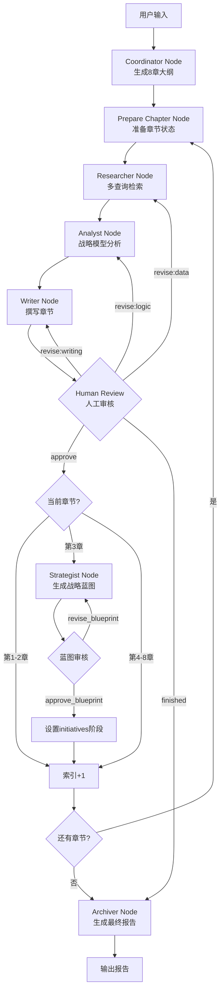

# Agent工作流设计文档

## 目录

- [概述](#概述)
- [架构设计](#架构设计)
- [核心节点说明](#核心节点说明)
- [工作流执行流程](#工作流执行流程)
- [状态管理](#状态管理)
- [战略模型体系](#战略模型体系)
- [人机协作机制](#人机协作机制)

---

## 概述

### 系统定位

本Agent系统是一个基于LangGraph的多智能体报告生成系统，专为省属国企战略规划报告设计。系统采用**两阶段战略推演架构**，通过8个专业化的Agent节点协同工作，生成符合国企公文规范的高质量战略规划报告。

### 核心特性

- **两阶段架构**：诊断阶段（第1-3章）+ 推演阶段（第4-8章）
- **战略模型注入**：每章节配备专业战略分析模型（PEST、SWOT、BCG等）
- **三层记忆系统**：长期记忆（RAG）+ 短期工作区 + 神圣上下文池
- **人机协作审核**：章节级审核 + 战略蓝图审核双重把关
- **国企公文语态**：专业的SOE（State-Owned Enterprise）语言风格

---

## 架构设计

### 两阶段战略推演架构

```
┌─────────────────────────────────────────────────────────┐
│                    诊断阶段 (Diagnosis)                  │
│                      Chapters 1-3                       │
│  ┌──────────────┐  ┌──────────────┐  ┌──────────────┐  │
│  │   第一章     │  │   第二章     │  │   第三章     │  │
│  │ 宏观政策环境 │  │ 区域战略定位 │  │ 内部诊断     │  │
│  │  (PEST模型)  │  │  (政策承接)  │  │ (SWOT+五力)  │  │
│  └──────────────┘  └──────────────┘  └──────────────┘  │
└─────────────────────────────────────────────────────────┘
                          ↓
            ┌─────────────────────────┐
            │   战略蓝图生成节点      │
            │   (Strategist Node)     │
            │  - SWOT提取             │
            │  - TOWS矩阵分析         │
            │  - 使命/支柱/KPI推导    │
            └─────────────────────────┘
                          ↓
            ┌─────────────────────────┐
            │   人工审核蓝图          │
            │   approve_blueprint?    │
            └─────────────────────────┘
                          ↓
┌─────────────────────────────────────────────────────────┐
│                   推演阶段 (Initiatives)                 │
│                      Chapters 4-8                       │
│  ┌──────────┐ ┌──────────┐ ┌──────────┐ ┌──────────┐  │
│  │ 第四章   │ │ 第五章   │ │ 第六章   │ │ 第七章   │  │
│  │总体思路  │ │主业举措  │ │创新驱动  │ │产业协同  │  │
│  │  (BSC)   │ │  (BCG)   │ │ (Ansoff) │ │  (ESG)   │  │
│  └──────────┘ └──────────┘ └──────────┘ └──────────┘  │
│  ┌──────────┐                                          │
│  │ 第八章   │                                          │
│  │治理效能  │                                          │
│  │  (7S)    │                                          │
│  └──────────┘                                          │
└─────────────────────────────────────────────────────────┘
                          ↓
            ┌─────────────────────────┐
            │   报告生成节点          │
            │   (Archiver Node)       │
            │  - 执行摘要             │
            │  - 完整报告组装         │
            │  - 战略蓝图附录         │
            └─────────────────────────┘
```

### 系统架构图

```
┌────────────────────────────────────────────────────────────┐
│                     用户输入层                              │
│                  (User Input: 生成江西交投集团战略规划)     │
└────────────────────────────────────────────────────────────┘
                            ↓
┌────────────────────────────────────────────────────────────┐
│                  LangGraph工作流引擎                        │
│  ┌──────────────────────────────────────────────────────┐  │
│  │           StateGraph (全局状态管理)                  │  │
│  │  ┌────────────────────────────────────────────────┐  │  │
│  │  │  GraphState:                                   │  │  │
│  │  │  - user_input                                  │  │  │
│  │  │  - global_plan (8章元数据)                     │  │  │
│  │  │  - current_chapter_index                       │  │  │
│  │  │  - strategic_blueprint                         │  │  │
│  │  │  - current_phase (diagnosis/initiatives)       │  │  │
│  │  │  - context_pool (已审核章节)                   │  │  │
│  │  │  - chapter_scratchpad (当前章节工作区)         │  │  │
│  │  │  - current_draft                               │  │  │
│  │  │  - review_decision                             │  │  │
│  │  └────────────────────────────────────────────────┘  │  │
│  └──────────────────────────────────────────────────────┘  │
│                                                            │
│  ┌──────────────────────────────────────────────────────┐  │
│  │              8个专业化Agent节点                      │  │
│  │                                                      │  │
│  │  coordinator → prepare_chapter → researcher         │  │
│  │       ↓              ↓                 ↓             │  │
│  │  analyst → writer → human_review → strategist       │  │
│  │                               ↓                     │  │
│  │                           archiver                   │  │
│  └──────────────────────────────────────────────────────┘  │
│                                                            │
│  ┌──────────────────────────────────────────────────────┐  │
│  │           MemorySaver (检查点持久化)                 │  │
│  │  - 支持中断和恢复执行                                │  │
│  │  - interrupt_before=["human_review"]                │  │
│  └──────────────────────────────────────────────────────┘  │
└────────────────────────────────────────────────────────────┘
                            ↓
┌────────────────────────────────────────────────────────────┐
│                    外部系统层                               │
│  ┌──────────────────┐  ┌──────────────────┐              │
│  │  Milvus RAG系统  │  │   LLM服务        │              │
│  │  (向量检索)      │  │  (DeepSeek API)  │              │
│  └──────────────────┘  └──────────────────┘              │
└────────────────────────────────────────────────────────────┘
                            ↓
┌────────────────────────────────────────────────────────────┐
│                    输出层                                   │
│  - 完整战略规划报告 (Markdown)                             │
│  - 执行摘要 (1000字)                                       │
│  - 战略蓝图附录                                            │
└────────────────────────────────────────────────────────────┘
```

---

## 核心节点说明

### 1. Coordinator Node（协调节点）

**位置**：`rag_project/agent/nodes/coordinator.py`

**功能**：生成固定的8章战略规划大纲

**核心逻辑**：
```python
# 不使用LLM动态生成，而是返回固定的8章结构
global_plan = [
    {
        "title": "第一章：宏观政策环境与时代要求",
        "phase": "diagnosis",
        "analysis_model": "PEST模型 (侧重P-政策与E-经济维度)",
        "index": 0
    },
    {
        "title": "第二章：区域战略与'交通强省'建设剖析",
        "phase": "diagnosis",
        "analysis_model": "无特定模型，侧重省级政策承接与区域占位分析",
        "index": 1
    },
    {
        "title": "第三章：行业演进趋势与当前内部诊断",
        "phase": "diagnosis",
        "analysis_model": "波特五力模型与SWOT分析",
        "index": 2
    },
    # ... 第4-8章 (initiatives阶段)
]
```

**输出**：
- `global_plan`: 8章完整大纲（含phase和analysis_model元数据）
- `current_chapter_index`: 0
- `current_phase`: "diagnosis"

---

### 2. Prepare Chapter Node（章节准备节点）

**位置**：`rag_project/agent/nodes/prep_chapter.py`

**功能**：为当前章节准备上下文和状态

**核心逻辑**：
1. 从`global_plan`中获取当前章节的元数据（title, phase, analysis_model）
2. 将`chapter_title`转换为研究问题（`chapter_question`）
3. 构建章节上下文（`chapter_context`）：
   - 诊断阶段：仅包含用户输入
   - 推演阶段：自动注入战略蓝图内容
4. 清空`chapter_scratchpad`为新章节做准备

**特殊处理（推演阶段）**：
```python
if phase == "initiatives" and strategic_blueprint.get("approved"):
    # 注入战略蓝图约束
    blueprint_context = f"""
    **核心使命**: {mission}
    **战略支柱**: {pillars}
    **关键KPI**: {kpis}
    """
    chapter_context = blueprint_context + "\n" + user_input
```

**输出**：
- `chapter_title`: 章节标题
- `chapter_question`: 研究问题
- `chapter_context`: 章节上下文（可能包含战略蓝图）
- `chapter_scratchpad`: {}（已清空）

---

### 3. Researcher Node（研究节点）

**位置**：`rag_project/agent/nodes/researcher.py`

**功能**：从知识库检索相关文档

**核心逻辑**：
1. **多查询生成**：使用LLM生成3-5个多样化的检索查询
2. **并行检索**：对每个查询执行RAG检索（top_k=20）
3. **去重处理**：基于文本哈希去重
4. **结果排序**：按相似度分数排序，保留top 20

**流程图**：
```
chapter_question
    ↓
[LLM生成3-5个查询]
    ↓
[并行执行RAG检索] → Milvus向量数据库
    ↓
[合并所有结果] (可能60-100个文档)
    ↓
[去重] (基于text hash)
    ↓
[排序并截取] top 20
    ↓
存入chapter_scratchpad["retrieved_docs"]
```

**输出**：
- `chapter_scratchpad["queries"]`: 使用的查询列表
- `chapter_scratchpad["retrieved_docs"]`: 检索到的文档列表

---

### 4. Analyst Node（分析节点）

**位置**：`rag_project/agent/nodes/analyst.py`

**功能**：使用战略模型分析检索到的文档

**核心逻辑**：
1. **获取当前章节元数据**：从`global_plan`中提取`analysis_model`和`phase`
2. **生成文档摘要**：限制前10个文档，避免超过token限制
3. **模型注入分析**：根据`analysis_model`动态注入分析框架
4. **结构化输出**：key_facts（可能按模型维度结构化）+ insights

**支持的模型及输出格式**：

| 模型 | key_facts结构 | 特殊要求 |
|------|--------------|----------|
| PEST | {"Political": [], "Economic": [], "Social": [], "Technological": []} | 侧重政策与经济维度 |
| SWOT | {"Strengths": [], "Weaknesses": [], "Opportunities": [], "Threats": []} | 每维度至少2-3项 |
| BCG | {"现金牛业务": [], "明星业务": [], "问题业务": [], "瘦狗业务": []} | 识别主业作为现金牛 |
| 波特五力 | {"现有竞争者": [], "潜在进入者": [], ...} | 五个维度完整覆盖 |
| BSC | {"财务维度": [], "客户/民生维度": [], "内部运营维度": [], "学习与成长维度": []} | 包含可量化目标 |
| Ansoff | {"市场渗透": [], "市场开发": [], "产品开发": [], "多元化": []} | 识别第二增长曲线 |
| 7S | {"Strategy": [], "Structure": [], "Systems": [], ...} | 强调要素协调性 |
| ESG | {"Environment": [], "Social": [], "Governance": [], "产业链协同": []} | 强调社会责任 |

**输出**：
- `chapter_scratchpad["document_summary"]`: 文档摘要
- `chapter_scratchpad["key_facts"]`: 结构化关键事实
- `chapter_scratchpad["insights"]`: 洞察列表
- `chapter_scratchpad["analysis_model_used"]`: 使用的分析模型

---

### 5. Writer Node（撰写节点）

**位置**：`rag_project/agent/nodes/writer.py`

**功能**：基于分析结果撰写章节内容

**核心逻辑**：
1. **构建写作提示词**：
   - 基础信息：章节标题、研究问题、分析模型
   - 输入数据：key_facts、insights、document_summary
   - **战略约束**（推演阶段）：注入战略蓝图（使命、支柱、KPI）
   - **模型约束**：根据analysis_model注入特定写作要求

2. **LLM生成**：调用LLM生成800-1200字的章节草稿

3. **引用后处理**：
   - 提取`document_summary`中的文件名映射
   - 将草稿中的`[来源: Document X]`替换为`[来源: 实际文件名.pdf]`

**写作要求**：
```
1. 篇幅：800-1200字（中文字符）
2. 语态：国企公文语态（"深入贯彻"、"全面落实"、"扎实推进"）
3. 结构：
   - 开头（2-3句话）：概述主题和核心观点
   - 主体（2-3个小节）：详细阐述，使用小标题
   - 结尾（1-2句话）：总结或展望
4. 引用：[来源: 文件名, 页码] 或 [来源: 文件名]
5. 格式：Markdown，必须以章节标题开头
```

**输出**：
- `current_draft`: 生成的章节草稿

---

### 6. Strategist Node（战略家节点）

**位置**：`rag_project/agent/nodes/strategist.py`

**触发时机**：第3章（index=2）完成并通过审核后

**功能**：基于诊断阶段生成战略蓝图

**核心逻辑**：
1. **提取SWOT**：从第3章中提取结构化的SWOT分析
2. **TOWS矩阵分析**：生成SO、WO、ST、WT四类策略
3. **推导战略要素**：
   - 核心使命（20-30字）
   - 战略支柱（3-5个）
   - KPIs（按BSC四个维度）
4. **返回草案**：`approved: False`（等待人工审核）

**战略蓝图结构**：
```json
{
    "mission": "服务交通强省战略，打造一流综合交通投资运营集团",
    "swot_analysis": {
        "strengths": ["省属国企平台优势", ...],
        "weaknesses": ["创新能力有待提升", ...],
        "opportunities": ["交通强省战略机遇", ...],
        "threats": ["经济下行压力", ...]
    },
    "tows_strategies": {
        "SO": ["利用省属平台优势，抢抓交通强省战略机遇", ...],
        "WO": ["通过战略合作弥补创新短板", ...],
        "ST": ["强化风险防控应对经济下行", ...],
        "WT": ["深化改革提升组织韧性", ...]
    },
    "strategic_pillars": [
        "战略支柱1：主业提质 - 夯实交通投资建设主阵地",
        "战略支柱2：创新驱动 - 培育智慧绿色交通新动能",
        "战略支柱3：产业协同 - 构建交旅融合新生态",
        "战略支柱4：治理提升 - 完善现代企业制度"
    ],
    "kpis": {
        "财务维度": {"营收增长率": "年增长8%", ...},
        "客户/民生维度": {"公众满意度": "提升至90分", ...},
        "运营维度": {"项目按期完工率": "达到95%", ...},
        "学习成长维度": {"员工培训覆盖率": "100%", ...}
    },
    "approved": false
}
```

**输出**：
- `strategic_blueprint`: 战略蓝图（未批准状态）
- `current_draft`: ""（清空以信号蓝图审核）

---

### 7. Human Review Node（人工审核节点）

**位置**：`rag_project/agent/nodes/human_review.py`

**功能**：处理人工审核决策并路由到下一节点

**支持的审核决策**：

| 决策 | 说明 | 路由目标 | 状态变更 |
|------|------|---------|---------|
| `approve` | 批准章节 | 下一章节或strategist | context_pool累加，index+1 |
| `revise:data` | 数据问题 | researcher | 保持状态不变 |
| `revise:logic` | 逻辑问题 | analyst | 保持状态不变 |
| `revise:writing` | 写作问题 | writer | 保持状态不变 |
| `approve_blueprint` | 批准蓝图 | prepare_chapter | phase="initiatives"，blueprint.approved=True |
| `revise_blueprint` | 修订蓝图 | strategist | 保持状态不变 |
| `finished` | 提前结束 | archiver | 无 |

**特殊逻辑**：
1. **第3章完成后**：
   - 将第3章添加到context_pool
   - **不增加索引**，等待蓝图生成
   - 路由到strategist

2. **蓝图批准后**：
   - 设置`current_phase = "initiatives"`
   - 标记`strategic_blueprint["approved"] = True`
   - 准备进入第4章

**输出**：
根据决策更新状态（见上表）

---

### 8. Archiver Node（归档节点）

**位置**：`rag_project/agent/nodes/archiver.py`

**触发时机**：所有章节完成或用户提前结束

**功能**：生成最终报告

**核心逻辑**：
1. **创建封面**：标题、日期、主题
2. **生成执行摘要**（新增）：
   - 使用LLM生成1000字摘要
   - 国企公文语态
   - 强调战略使命和政策对标
3. **创建目录**：自动提取章节标题
4. **合并章节**：使用分隔符连接所有章节
5. **创建战略蓝图附录**（新增）：
   - 核心使命
   - SWOT分析矩阵
   - TOWS战略组合
   - 战略支柱
   - 关键绩效指标

**最终报告结构**：
```
# 封面
  - 标题：江西交通投资集团战略规划报告
  - 生成时间：2026年04月01日
  - 主题：用户输入的主题

---

# 执行摘要
  [1000字国企公文语态的摘要]

---

## 目录
  1. 第一章：宏观政策环境与时代要求
  2. 第二章：区域战略与'交通强省'建设剖析
  ...

---

[第一章内容]

---

[第二章内容]

---

...

---

# 附录：战略蓝图详述
  ## 核心使命
  ## SWOT分析矩阵
  ## TOWS战略组合
  ## 战略支柱
  ## 关键绩效指标
```

**输出**：
- `final_report`: 完整报告（Markdown格式）

---

## 工作流执行流程

### 完整执行流程图



### 两阶段流转详解

#### 诊断阶段（第1-3章）

```
第1章（index=0）：
  coordinator → prepare_chapter → researcher → analyst → writer → human_review
  ↓ (approve)
  context_pool += [第1章], index = 1

第2章（index=1）：
  prepare_chapter → researcher → analyst → writer → human_review
  ↓ (approve)
  context_pool += [第2章], index = 2

第3章（index=2）：
  prepare_chapter → researcher → analyst → writer → human_review
  ↓ (approve)
  context_pool += [第3章], index保持=2（等待蓝图）
  ↓
  【触发strategist】
  提取SWOT → TOWS分析 → 生成蓝图
  ↓
  human_review (蓝图审核)
  ↓ (approve_blueprint)
  phase = "initiatives", index = 3
```

#### 推演阶段（第4-8章）

```
第4章（index=3）：
  prepare_chapter (注入蓝图约束) → researcher → analyst (BSC) → writer (蓝图约束) → human_review
  ↓ (approve)
  context_pool += [第4章], index = 4

第5-7章：
  同上流程，使用各自的战略模型

第8章（index=7）：
  prepare_chapter → researcher → analyst (7S) → writer → human_review
  ↓ (approve)
  context_pool += [第8章], index = 8
  ↓
  【触发archiver】
  生成执行摘要 → 组装报告 → 添加蓝图附录
  ↓
  输出final_report
```

---

## 状态管理

### GraphState结构

```python
class GraphState(TypedDict):
    """LangGraph工作流的全局状态定义"""

    # --- 输入层 ---
    user_input: str  # 用户的原始请求

    # --- 全局规划层 ---
    global_plan: List[Dict]  # 8章元数据（title, phase, analysis_model, index）
    current_chapter_index: int  # 当前章节索引（0-7）

    # --- 战略蓝图层（两阶段架构）---
    strategic_blueprint: Optional[Dict]  # 战略蓝图（包含mission, swot_analysis, tows_strategies, pillars, kpis, approved状态）
    current_phase: str  # "diagnosis" 或 "initiatives"

    # --- 上下文层（长期/跨章节记忆）---
    context_pool: Annotated[List[str], operator.add]  # 已审核通过的章节原文（使用operator.add确保累加）
    context_summary: str  # 压缩后的全局上下文摘要

    # --- 当前章节层（短期/工作区记忆）---
    chapter_title: str  # 当前章节标题
    chapter_question: str  # 当前章节的研究问题
    chapter_context: str  # 当前章节的上下文信息
    chapter_scratchpad: Dict  # 本章的结构化草稿本
    current_draft: str  # Writer生成的当前草稿文本

    # --- 控制层 ---
    human_feedback: Dict  # 人类结构化反馈指令
    review_decision: str  # 审核决策: "approve", "revise:data", "revise:logic", "revise:writing", "finished", "approve_blueprint", "revise_blueprint"
```

### 三层记忆架构

```
┌─────────────────────────────────────────────────────────┐
│  第一层：长期记忆（Long-term Memory）                    │
│  ┌───────────────────────────────────────────────────┐  │
│  │  Milvus RAG系统                                   │  │
│  │  - 存储所有知识库文档的向量                        │  │
│  │  - 仅Researcher节点可访问                         │  │
│  │  - 支持语义检索和相似度匹配                        │  │
│  └───────────────────────────────────────────────────┘  │
└─────────────────────────────────────────────────────────┘

┌─────────────────────────────────────────────────────────┐
│  第二层：短期工作区（Short-term Workspace）              │
│  ┌───────────────────────────────────────────────────┐  │
│  │  chapter_scratchpad                               │  │
│  │  - 当前章节专属沙盒                               │  │
│  │  - 存储中间结果：                                 │  │
│  │    * queries: 使用的检索查询                       │  │
│  │    * retrieved_docs: 检索到的文档                  │  │
│  │    * document_summary: 文档摘要                    │  │
│  │    * key_facts: 关键事实                          │  │
│  │    * insights: 洞察                               │  │
│  │    * analysis_model_used: 使用的分析模型           │  │
│  │  - 阅后即焚（章节完成后清空）                      │  │
│  └───────────────────────────────────────────────────┘  │
└─────────────────────────────────────────────────────────┘

┌─────────────────────────────────────────────────────────┐
│  第三层：神圣上下文池（Sacred Context Pool）             │
│  ┌───────────────────────────────────────────────────┐  │
│  │  context_pool                                     │  │
│  │  - 仅存入人工审核通过的章节定稿                    │  │
│  │  - 使用Annotated[List[str], operator.add]确保累加 │  │
│  │  - 跨章节共享，作为后续章节的上下文                │  │
│  │  - 不可修改，只能追加                             │  │
│  └───────────────────────────────────────────────────┘  │
└─────────────────────────────────────────────────────────┘
```

### 状态流转示例

```
初始状态：
{
    "user_input": "生成江西交投集团战略规划",
    "global_plan": [],
    "current_chapter_index": 0,
    "strategic_blueprint": None,
    "current_phase": "diagnosis",
    "context_pool": [],
    "chapter_scratchpad": {},
    "current_draft": "",
    "review_decision": None
}

↓ coordinator_node

{
    "global_plan": [8章元数据],
    "current_chapter_index": 0,
    "current_phase": "diagnosis"
}

↓ prepare_chapter_node

{
    "chapter_title": "第一章：宏观政策环境与时代要求",
    "chapter_question": "宏观政策环境与时代要求是什么？",
    "chapter_context": "生成江西交投集团战略规划",
    "chapter_scratchpad": {}
}

↓ researcher_node

{
    "chapter_scratchpad": {
        "queries": ["政策环境", "时代要求", "交通政策"],
        "retrieved_docs": [20个文档]
    }
}

↓ analyst_node

{
    "chapter_scratchpad": {
        "queries": [...],
        "retrieved_docs": [...],
        "document_summary": "Document 1...",
        "key_facts": {"Political": [...], "Economic": [...]},
        "insights": ["洞察1", "洞察2"],
        "analysis_model_used": "PEST模型"
    }
}

↓ writer_node

{
    "current_draft": "# 第一章：宏观政策环境与时代要求\n\n..."
}

↓ human_review_node (approve)

{
    "context_pool": ["# 第一章：宏观政策环境与时代要求\n\n..."],
    "chapter_scratchpad": {},
    "current_chapter_index": 1
}

↓ ... (第2-3章类似)

↓ strategist_node (第3章后)

{
    "strategic_blueprint": {
        "mission": "服务交通强省战略...",
        "swot_analysis": {...},
        "tows_strategies": {...},
        "strategic_pillars": [...],
        "kpis": {...},
        "approved": false
    },
    "current_draft": ""
}

↓ human_review_node (approve_blueprint)

{
    "strategic_blueprint": {..., "approved": true},
    "current_phase": "initiatives",
    "chapter_scratchpad": {}
}

↓ ... (第4-8章，注入蓝图约束)

↓ archiver_node

{
    "final_report": "# 封面\n\n---\n\n# 执行摘要\n\n..."
}
```

---

## 战略模型体系

### 模型映射表

| 章节 | 阶段 | 分析模型 | 核心维度 | 特殊要求 |
|------|------|---------|---------|---------|
| 第1章 | diagnosis | PEST模型 | Political, Economic, Social, Technological | 侧重政策与经济维度 |
| 第2章 | diagnosis | 政策承接分析 | 省级政策承接、区域占位 | 无特定模型框架 |
| 第3章 | diagnosis | 波特五力 + SWOT | 五力 + Strengths/Weaknesses/Opportunities/Threats | 必须输出结构化SWOT矩阵 |
| 第4章 | initiatives | 平衡计分卡(BSC) | 财务、客户/民生、内部运营、学习与成长 | 包含可量化目标 |
| 第5章 | initiatives | BCG波士顿矩阵 | 现金牛、明星、问题、瘦狗 | 主业作为现金牛业务 |
| 第6章 | initiatives | 安索夫矩阵 | 市场渗透、市场开发、产品开发、多元化 | 识别第二增长曲线 |
| 第7章 | initiatives | ESG + 产业链协同 | Environment, Social, Governance, 产业链协同 | 强调社会责任 |
| 第8章 | initiatives | 麦肯锡7S | Strategy, Structure, Systems, Shared Values, Style, Staff, Skills | 强调要素协调性 |

### 模型注入机制

**Analyst节点**：通过`_get_model_instruction()`函数注入模型特定的分析指令

```python
def _get_model_instruction(analysis_model: str) -> str:
    if "PEST" in analysis_model:
        return """
        **强制使用PEST模型框架分析**：
        - Political (政策/政治)
        - Economic (经济)
        - Social (社会)
        - Technological (技术)

        返回格式：
        {
            "key_facts": {
                "Political": ["政策事实1", ...],
                "Economic": ["经济事实1", ...],
                ...
            }
        }
        """
    # ... 其他模型
```

**Writer节点**：通过`_get_model_writing_instruction()`函数注入模型特定的写作要求

```python
def _get_model_writing_instruction(analysis_model: str, phase: str) -> str:
    if "PEST" in analysis_model:
        return """
        **写作要求**: 必须体现PEST模型的四个维度
        - 使用小标题明确区分: 政策环境 (Political)、经济影响 (Economic)、社会因素 (Social)、技术发展 (Technological)
        - 在每个维度下展开分析
        - 重点突出政策与经济维度
        """
    # ... 其他模型
```

### 战略蓝图约束注入（推演阶段）

**Prepare Chapter节点**：
```python
if phase == "initiatives" and strategic_blueprint.get("approved"):
    blueprint_context = f"""
    **核心使命**: {mission}
    **战略支柱**: {pillars}
    **关键KPI**: {kpis}
    """
    chapter_context = blueprint_context + "\n" + user_input
```

**Writer节点**：
```python
def _build_blueprint_constraint(strategic_blueprint: Dict) -> str:
    if not strategic_blueprint:
        return ""

    return """
    ## 战略蓝图约束（本章节必须遵循）

    **核心使命**: {mission}
    **战略支柱**: {pillars}
    **关键绩效指标**: {kpis}

    **强制要求**:
    1. 显式说明本章举措如何支撑上述核心使命
    2. 阐明本章内容与战略支柱的关系
    3. 确保提出的目标与KPI体系保持一致
    """
```

### 引用后处理系统

Writer节点实现了引用后处理，将LLM生成的通用引用替换为实际文件名：

```python
# 1. 从document_summary提取映射
mapping = _extract_filename_mapping(document_summary)
# {"Document 1": "中国交通年鉴2021_merged", "Document 2": "省交通运输厅报告", ...}

# 2. 替换通用引用（过滤掉"来源文档_X"等通用文件名）
draft = _replace_document_x_with_filenames(draft, mapping, document_summary)
# "[来源: Document 1, 第15页]" → "[来源: 中国交通年鉴2021_merged, 第15页]"
```

**Archiver节点的二级引用修复：**

在最终报告中搜索残余的`[来源: 来源文档_X]`引用，使用引用附近文本查询Milvus获取真实来源文件名：
```python
# 从报告文本中提取引用上下文 → Milvus检索 → 替换通用引用
fixed_report = _fix_generic_citations(full_report)
```

**引用质量验证（2026-04-04测试）：**
- 总引用: 80个 | 真实文件名: 80个 | 通用引用: 0个 | **质量率: 100%**

---

## 人机协作机制

### 审核决策路由

```python
def should_continue(state: Dict[str, Any]) -> str:
    decision = state.get("review_decision")
    current_index = state.get("current_chapter_index", 0)
    blueprint = state.get("strategic_blueprint", {})

    # 修订路由
    if decision == "revise:data":
        return "researcher"
    elif decision == "revise:logic":
        return "analyst"
    elif decision == "revise:writing":
        return "writer"
    elif decision == "finished":
        return "end"

    # 战略蓝图路由
    if decision == "revise_blueprint":
        return "strategist"
    if decision == "approve_blueprint":
        return "prepare_chapter"

    # 正常章节流转
    if decision == "approve" or decision is None:
        if current_index == 2:  # 第3章完成
            if not blueprint or not blueprint.get("approved"):
                return "strategist"  # 生成蓝图
            else:
                # 蓝图已批准，继续第4章
                if current_index + 1 < len(global_plan):
                    return "prepare_chapter"
                else:
                    return "end"

        # 其他章节
        if current_index + 1 < len(global_plan):
            return "prepare_chapter"
        else:
            return "end"

    return "end"
```

### 中断机制

**配置**：
```python
# graph.py
app = workflow.compile(
    checkpointer=MemorySaver(),
    interrupt_before=["human_review"]  # 在human_review前中断
)
```

**工作原理**：
1. 工作流执行到`human_review`节点前自动暂停
2. 等待外部注入`review_decision`
3. 恢复执行后，根据决策路由到相应节点

**使用示例**：
```python
# 启动工作流
config = {"configurable": {"thread_id": "report-001"}}
initial_state = {"user_input": "生成江西交投集团战略规划"}

# 执行到第一个中断点
result = app.invoke(initial_state, config)

# 此时工作流暂停在human_review前
# 人工审核current_draft...

# 注入审核决策并恢复执行
app.invoke({"review_decision": "approve"}, config)
```

### 持久化与恢复

**MemorySaver检查点**：
- 自动保存每个节点执行后的状态
- 支持从任意检查点恢复执行
- thread_id用于区分不同的报告生成任务

**状态快照**：
```python
# 获取当前状态快照
snapshot = app.get_state(config)
print(snapshot.values)  # 当前状态值
print(snapshot.next)    # 下一个要执行的节点

# 从特定检查点恢复
app.invoke(None, config)  # 继续执行
```

---

## 总结

### 设计亮点

1. **两阶段架构**：诊断→战略蓝图→推演，逻辑清晰
2. **战略模型体系**：8个章节配备8种专业战略模型
3. **三层记忆系统**：长期RAG + 短期工作区 + 神圣上下文池
4. **战略蓝图约束**：推演阶段强制遵循诊断阶段的战略输出
5. **人机协作**：章节级审核 + 蓝图审核双重把关
6. **国企公文语态**：专业的SOE语言风格

### 关键技术

- **LangGraph StateGraph**：状态图工作流引擎
- **Milvus RAG**：向量检索增强生成
- **DeepSeek LLM**：大语言模型服务
- **MemorySaver**：检查点持久化机制
- **Annotated Types**：类型注解状态累加

### 适用场景

- 省属国企战略规划报告
- 政策导向型研究报告
- 多章节结构化文档生成
- 需要人工审核把关的内容生成

---

**文档版本**: v1.0
**最后更新**: 2026-04-01
**作者**: RAG Project Team
